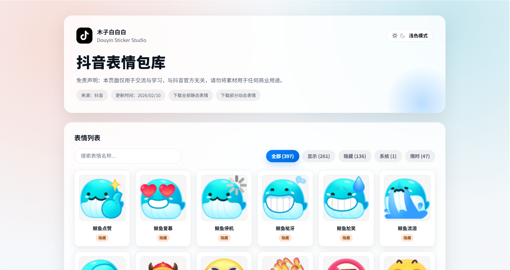
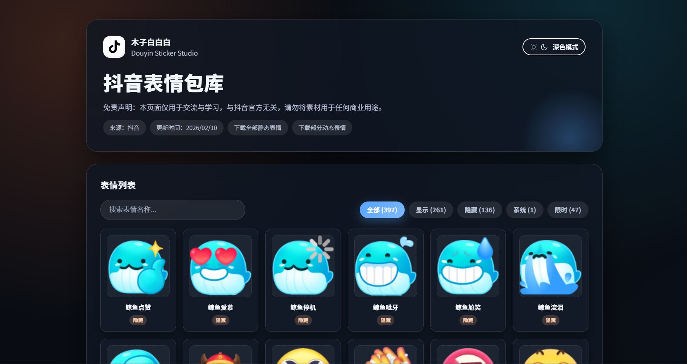

# 抖音表情包库

一个用于浏览、搜索和下载抖音小表情资源的静态页面。页面会读取根目录下的 `info.json`，再按其中的 `stickers[].uri` 从 `static/` 目录加载对应表情图片。

> 本项目仅用于个人学习与交流，素材版权归抖音及相关权利方所有。请勿将本项目或其中素材用于商业用途。

## 截图

<p align="center">
  
  
</p>

## 功能

- 自动加载 `info.json` 并渲染表情列表。
- 支持按表情名称搜索。
- 支持按全部、显示、隐藏、系统、限时表情筛选。
- 支持浅色/深色模式切换，并记住本地偏好。
- 点击表情可预览大图并下载单个图片。
- 支持在页面内手动上传新的 `info.json` 进行临时预览。

## 目录结构

```text
.
├── index.html          # 页面入口，可修改标题、更新时间、下载链接等展示信息
├── info.json           # 表情元数据，页面默认从这里读取
├── static/             # 表情图片资源，文件名需与 info.json 中的 uri 对应
├── assets/             # 前端样式、脚本和图标
└── docs/images/        # README 截图
```

## 本地预览

因为页面使用 `fetch('./info.json')` 加载数据，建议通过本地 HTTP 服务预览，不要直接双击打开 `index.html`。

```bash
python -m http.server 8080
```

然后访问：

```text
http://localhost:8080
```

如果没有 Python，也可以用任意静态文件服务器部署本目录。

## 更新资源

常规更新只需要同步下面 3 类内容：

| 路径 | 用途 |
| --- | --- |
| `index.html` | 更新页面文案、更新时间、下载链接或统计说明等展示内容 |
| `info.json` | 更新表情列表、显示状态、限时活动、图片文件名等元数据 |
| `static/` | 更新表情图片文件，文件名必须能被 `info.json` 中的 `uri` 字段引用 |

`assets/` 通常不需要随表情资源更新而修改，除非要调整页面样式或交互逻辑。

## 从安卓设备提取

`static/` 和 `info.json` 可以从抖音安卓应用数据目录中提取：

```text
/data/user/0/com.ss.android.ugc.aweme/small_emoji_res/
```

资源通常位于该目录下面两层的子目录中。提取时重点查找：

- `info.json`
- 与 `info.json` 中 `stickers[].uri` 对应的图片文件

## 校验清单

更新完成后建议检查：

- `info.json` 是合法 JSON。
- `info.json` 中每个需要展示的 `uri` 都能在 `static/` 中找到对应文件。
- `index.html` 中展示的更新时间和下载链接是最新的。
- 页面搜索、筛选、预览、下载功能正常。

## 部署

本项目是纯静态页面。将项目根目录中的文件部署到任意静态托管服务即可，至少需要包含：

- `index.html`
- `assets/`
- `static/`
- `info.json`

部署后访问站点根路径即可打开表情库。

## 许可证

项目代码使用 [MIT License](./LICENSE) 开源。

`static/` 中的表情素材及 `info.json` 中的抖音资源数据不包含在 MIT 授权范围内，版权归抖音及相关权利方所有。
